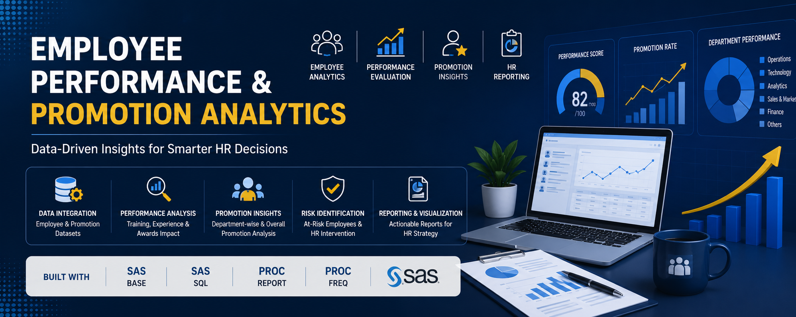

# 📊 Employee Performance & Promotion Analytics System (SAS)

  

## 🚀 Project Overview

This project analyzes employee performance, promotion eligibility, and workforce trends using SAS Base and SAS SQL. The system integrates employee records, training performance, promotion history, and recruitment information to generate actionable HR insights and support strategic decision-making.

The project processes over **54,000 employee records** and produces automated reports, statistical analysis, and visual dashboards for HR teams.

---

## 🎯 Objectives

* Analyze employee performance and promotion trends
* Identify high-performing employees
* Detect at-risk employees requiring HR intervention
* Evaluate department-wise promotion effectiveness
* Assess recruitment channel performance
* Generate automated HR reports and visualizations

---

## 🛠 Technologies Used

* SAS Base
* SAS SQL
* PROC REPORT
* PROC FREQ
* PROC MEANS
* DATA Step Programming
* Statistical Analysis
* Data Visualization

---

## 📂 Dataset Information

The dataset contains employee-related information including:

* Employee ID
* Department
* Region
* Education
* Gender
* Recruitment Channel
* Number of Trainings
* Age
* Previous Year Rating
* Length of Service
* Awards Won
* Average Training Score
* Promotion Status

Total Records Processed: **54,808**

---

## 🔍 Key Features

### Data Cleaning & Preparation

* Missing value treatment
* Data validation
* Derived variable creation
* Performance band classification
* Experience band categorization
* Promotion labeling

### Employee Performance Analysis

* Training score analysis
* Experience-based performance segmentation
* Department-wise performance tracking
* High performer identification

### Promotion Analytics

* Overall promotion rate calculation
* Department-wise promotion comparison
* Promotion trend analysis
* Promotion success indicators

### HR Risk Detection

* At-risk employee identification
* Low performance detection
* Promotion gap analysis
* HR intervention recommendations

### Statistical Analysis

* Chi-Square Tests
* Frequency Analysis
* Cross-tabulation Reports
* Comparative Performance Analysis

### Automated Reporting

* HR Summary Reports
* Department Performance Reports
* Promotion Effectiveness Reports
* Recruitment Channel Analysis

---

## 📈 Key Insights

### Promotion Summary

* Total Employees Analyzed: 54,808
* Total Promoted: 4,668
* Overall Promotion Rate: 8%

### Department Performance

Top Performing Departments:

* Operations
* Procurement
* Technology
* Analytics

Departments Requiring Attention:

* HR
* Legal
* R&D

### Training Impact

Employees scoring above 80 in training programs achieved significantly higher promotion rates compared to lower-performing groups.

### Awards Impact

Award-winning employees showed substantially higher promotion rates than non-award winners.

### Recruitment Effectiveness

Referred candidates demonstrated the highest promotion success rate among all recruitment channels.

---

## 📊 Reports Generated

### HR Report 1

Overall Promotion Summary

### HR Report 2

Department-wise Promotion Ranking

### HR Report 3

Training Score vs Promotion Analysis

### HR Report 4

Award Winners vs Non-Winners Promotion Impact

### HR Report 5

Recruitment Channel Effectiveness

### HR Report 6

At-Risk Employee Identification Report

---

## 📷 Project Screenshots

### Dataset Overview

### Promotion Summary

### Department-wise Analysis

### Visualization Dashboard

---

## 💡 Business Impact

* Improved workforce performance visibility
* Enabled data-driven promotion decisions
* Identified high-potential employees
* Highlighted employees requiring intervention
* Supported HR strategy through actionable insights

---

## 🔮 Future Enhancements

* Power BI Dashboard Integration
* Automated Email Reporting
* Predictive Promotion Modeling
* Employee Attrition Prediction
* Interactive HR Analytics Portal

---

## 👨‍💻 Author

**Shivang Gupta**

SAS Developer | Data Analyst | Business Intelligence Enthusiast
